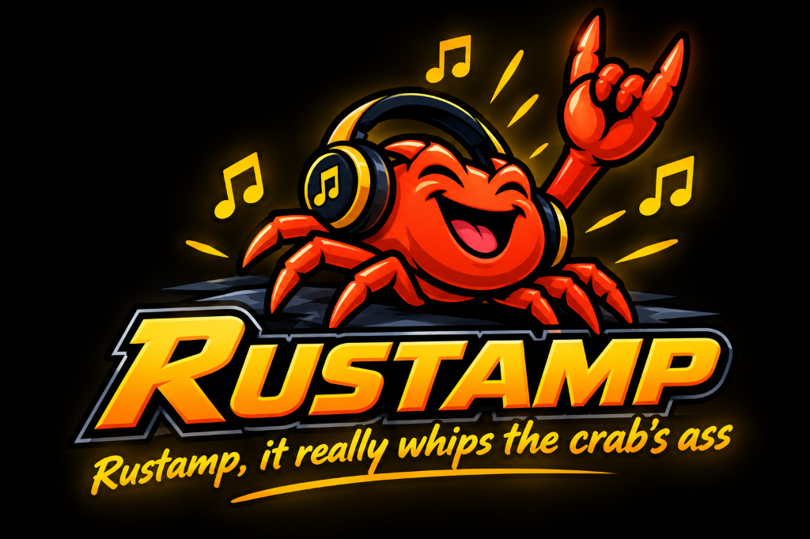

<div align="center">



# Rustamp

**A Winamp-inspired desktop music player written in Rust.**

[](https://github.com/dpomian/rustamp/actions/workflows/test.yml)
[](LICENSE)
[](https://www.rust-lang.org)
[](https://github.com/dpomian/rustamp/stargazers)
[](https://en.wikipedia.org/wiki/Winamp)

</div>

Point it at folders
containing audio files (MP3, FLAC, OGG/Vorbis, Opus, M4A/AAC, WAV, AIFF,
WavPack) and it builds a sorted library from their tags, then plays them
back with a live spectrum visualizer.

Built with [egui/eframe](https://github.com/emilk/egui) for the UI and
[rodio](https://github.com/RustAudio/rodio) for audio playback.

## Features

- Watch folders — recursively scans for audio files, deduplicates, reads tags
- Drag & drop — drop folders to watch them, or drop files to play them
- Playlist with filter/search, sortable columns, shuffle, and repeat (off / all / one)
- Play, pause, stop, prev/next, seek bar, volume control
- Real-time spectrum analyzer fed from the decoded audio stream
- Color skins — 9 built-in presets, plus hand-editable custom skins
- Persistent config (folders + volume + skin) in your platform config dir
- Resume playback — reopens the last track paused where you left off

## Run

Requires a recent stable Rust toolchain.

```sh
cargo run --release
```

Then click **Add folder…** to pick directories containing music.

### Skins

Pick a preset from the dropdown next to the volume slider — `winamp`,
`amber`, `ice`, `vaporwave`, `sunset`, `rose`, `candy`, `forest`, `paper`.

For a custom look, edit the `skin` object in `config.json` (in your
platform config dir, e.g. `~/Library/Application Support/rustamp/` on
macOS). Colors are `"#rrggbb"` strings and every field is optional —
anything you omit keeps the winamp default:

```json
"skin": {
  "accent": "#ff71ce",
  "spectrum": { "low": "#b967ff", "mid": "#ff71ce", "high": "#fffb96" }
}
```

Set `"background"`, `"selection"`, `"text"`, or `"dark": false` (for the
light base theme) to restyle the standard widgets too. Once your skin
doesn't match a preset exactly, the dropdown shows `custom`.

### Keyboard shortcuts

| Key         | Action                    |
| ----------- | ------------------------- |
| `Space`     | Play / pause              |
| `Enter`     | Play selected track       |
| `N` / `P`   | Next / previous track     |
| `←` / `→`   | Seek -/+ 5 seconds        |
| `↑` / `↓`   | Volume up / down          |

## Project layout

```
src/
  audio/      playback (rodio), sample tap, spectrum analyzer (FFT)
  library/    track model, folder scanning (walkdir + lofty)
  ui/         egui app and widgets
  config.rs   persisted settings
  playlist.rs track order, shuffle, repeat logic
  skin.rs     color themes: presets, serde, egui visuals
```

## Contributing

Issues and pull requests are welcome. See [ARCHITECTURE.md](docs/ARCHITECTURE.md)
for how the modules fit together before making changes.

- Keep changes focused on the task at hand.
- Write unit tests for new logic — most modules already have `#[cfg(test)]`
  coverage to follow as an example.
- Before submitting, run and fix all warnings:

```sh
cargo fmt
cargo clippy
cargo test
```

## License

[MIT](LICENSE)
